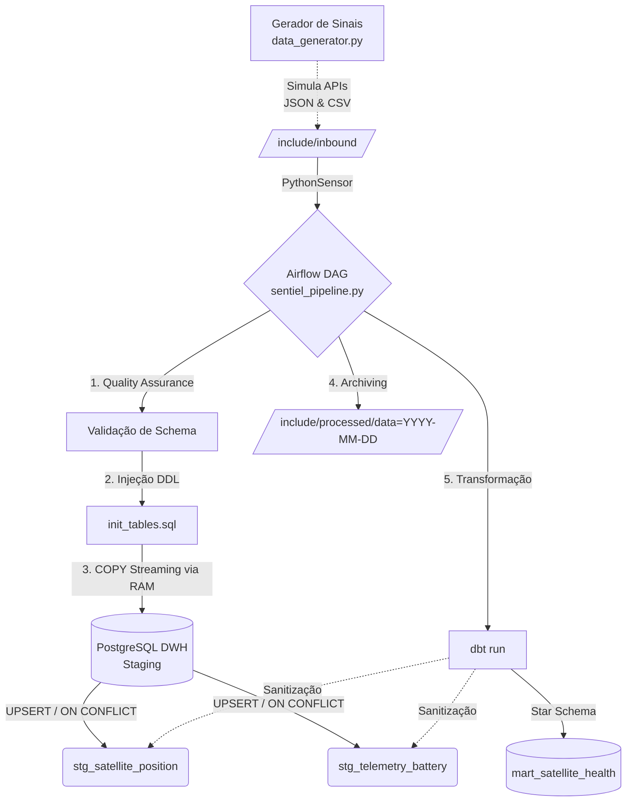

# 🛰️ Sentinela de Órbita: Pipeline de Dados da AeroSpace Insights


## 📌 O Cenário: AeroSpace Insights
A **AeroSpace Insights** é uma empresa especializada em monitorar a saúde de constelações de satélites de baixo custo (CubeSats). O desafio de engenharia nasce da recepção caótica de telemetrias que chegam via APIs de diversas estações terrestres e são despejadas em arquivos brutos e semi-estruturados.

Este projeto estabelece um **Pipeline ELT de Nível de Produção** que captura os dados de telemetria, organiza-os por Missão/Satélite e os insere com garantia de idempotência em um Data Warehouse, viabilizando análises críticas como falhas de bateria e desvios orbitais.

---

## 🏗️ Arquitetura do Pipeline

Os dados percorrem um fluxo orquestrado pelo **Apache Airflow**, passando por validação estrita, carga bruta de alta performance e arquivamento em estrutura de *Data Lake*.



---

## 🚀 Como Executar o Projeto Localmente

As dependências de isolamento já foram todas conteinerizadas. Você só precisa da [Astro CLI](https://docs.astronomer.io/astro/cli/install-cli) instalada.

1. **Clone o repositório e inicialize o ambiente:**
```bash
astro dev start
```

2. **Gere os arquivos de simulação (Mock API):**
```bash
python include/data_generator.py
```

3. **Inicie o Pipeline:**
Acesse o Webserver do Airflow em `http://localhost:8080` (auth: `admin`/`admin`), habilite a DAG `sentiel_pipeline` e assista aos containers processando a telemetria em tempo real!

---

## 🧠 Decisões de Arquitetura & Engenharia

### 1. Ingestão Bruta (`TEXT`)
> **"Por que carregar parâmetros numéricos como TEXT nas tabelas de staging?"**

Eu opto por carregar o dado bruto (Raw) na camada Landing/Staging para garantir a **Observabilidade** do sistema. Ao forçar a limpa de dados antes da inserção, perdemos a auditoria de erros. Por exemplo: Se o sensor térmico do satélite queimar e enviar a string `"NaN"`, uma coluna bloqueada como `NUMERIC` colapsaria a esteira. Utilizando `TEXT`, eu absorvo toda a carga em segurança e dedico o processo de Sanitização para uma camada secundária em SQL (Transformação), viabilizando estudos de falha (Data Quality).

### 2. Bypass de I/O em JSONs (Memória RAM)
Na carga dos arquivos `.json` via Airflow, em vez de ler o arquivo, converter para texto, escrever um arquivo temporário no disco (SSD) e só então processar no Banco de Dados, o pipeline executa um parse para a Memória RAM gerando um "buffer virtual". O Airflow recruta o túnel nato do `psycopg2` para despejar a carga dessa RAM diretamente nas tabelas usando o comando `COPY_EXPERT`, obliterando gargalos de I/O de disco.

### 3. Idempotência e Arquivamento (Particionamento Lake)
A inserção da DAG utiliza `ON CONFLICT DO NOTHING` para garantir que repetições de sinal do mesmo satélite no mesmo milissegundo jamais dupliquem registros no banco. Em seguida, os arquivos trafegados são ejetados da base primária para a camada Histórica `include/processed/data=YYYY-MM-DD/`, replicando o conceito de Storage Partitioning visto em S3 e Azure Blob Storage.

### 4. Transformação Analítica (dbt) e Data Quality Espacial
Para a camada analítica (`marts`), o pipeline aciona o **dbt** (Data Build Tool). O grande trunfo de engenharia aqui é o tratamento de campos textuais corrompidos, blindando as agregações matemáticas do BI. 
O dbt utiliza construções dinâmicas como `CAST(NULLIF(NULLIF(TRIM(voltage), ''), 'NaN') AS DECIMAL(5,2))` para higienizar espaços vazios fantasmas (`" "`) ou falhas atestadas da antena (`NaN`), substituindo-os nativamente por `NULL` lógicos do PostgreSQL **antes** que a conversão exija matemática do banco de dados. O resultado final é a tabela `mart_satellite_health`, um modelo Estrela de alta confiabilidade.
